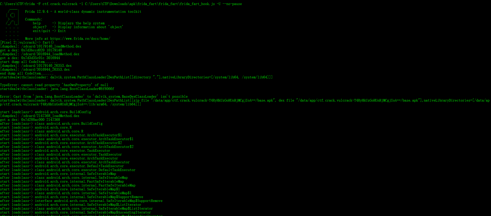
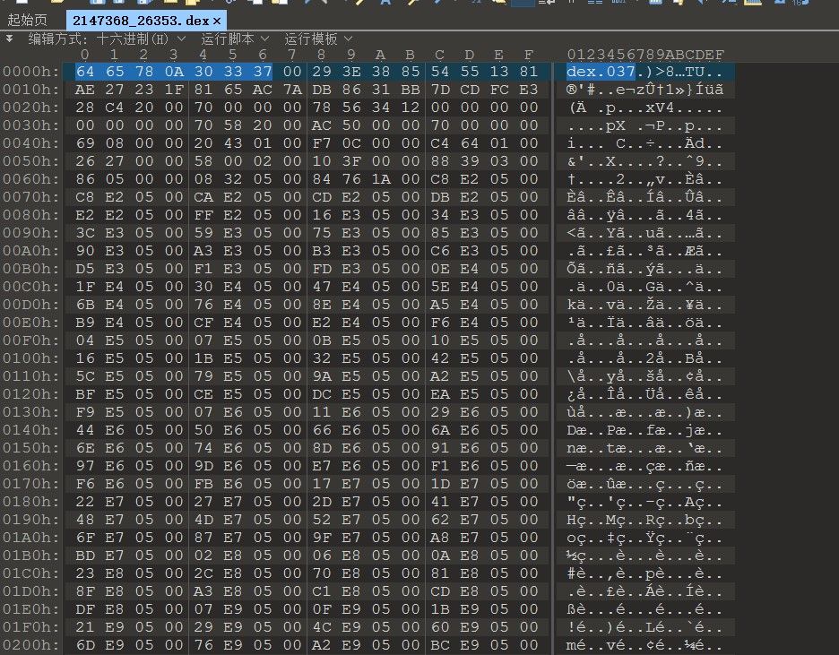
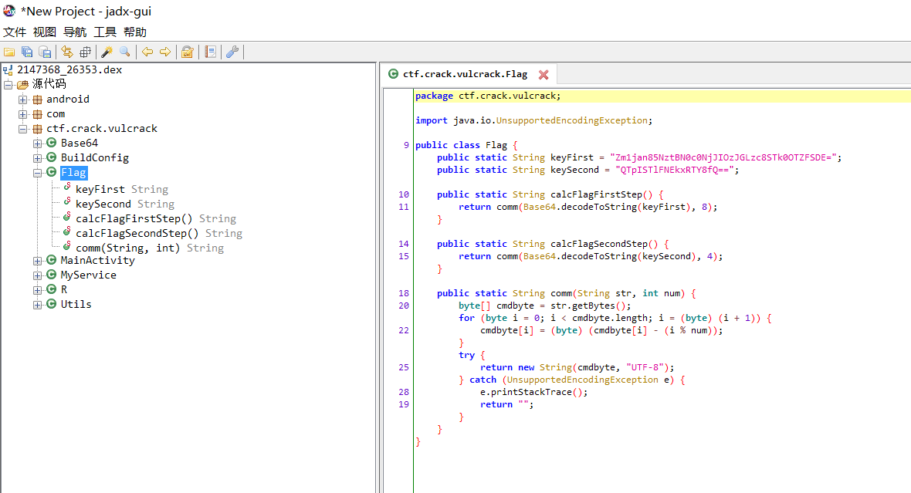

## Usage:

### 0x01 上传so文件 (frida_fart.zip) 至 `/data/local/tmp` 目录

建议：先上传tmp目录，再su 切换root账号，然后将 so文件 移动至 `/data/app` 目录

### 0x02 上传frida-server 至 /data/local/tmp

`adb push frida-server /data/local/tmp`

### 0x03 加载js，进行自动化脱壳

`frida -F ctf.crack.vulcrack -l frida_fart_hook.js -U --no-pause`

然后运行 `fart()`  函数

```
[Pixel 2::vulcrack]-> fart()
[dumpdex]: /sdcard/10179140_loadMethod.dex
got a dex: 0x7d3bccd020 10179140
[dumpdex]: /sdcard/3016944_loadMethod.dex
got a dex: 0x7d3d35c01c 3016944
start dump all CodeItem.......
[dumpdex]: /sdcard/10179140_26353.dex
[dumpdex]: /sdcard/3016944_26353.dex
end dump all CodeItem.......
startdealwithclassloader: dalvik.system.PathClassLoader[DexPathList[[directory "."],nativeLibraryDirectories=[/system/lib64, /system/lib64]]]
```


## 0x04 寻找需要的dex文件
`grep -r "MainActivity" -n ./*.dex`

```
grep -r "MainActivity" -n ./*.dex

Binary file ./10179140_26353.dex matches
Binary file ./10179140_loadMethod.dex matches
Binary file ./2147368_26353.dex matches
Binary file ./2147368_loadMethod.dex matches
```
发现 `2147368_26353.dex` 无法用 `jadx` 打开

尝试添加dex头 `64 65 78 0A 30 33 37`



再次尝试用jadx打开，成功看到反编译的java代码




# FART
ART环境下基于主动调用的自动化脱壳方案，基于Android 6.0实现，理论上可以移植到任何ART系统上，现在已经移植到Android 8.0，很快就将移植到Android 10.0。具体原理和实现请移步看雪，系列文章共计3篇，对加固和对抗感兴趣的可以看看：


1、拨云见日：安卓APP脱壳的本质以及如何快速发现ART下的脱壳点 https://bbs.pediy.com/thread-254555.htm


2、FART正餐前甜点：ART下几个通用简单高效的dump内存中dex方法 https://bbs.pediy.com/thread-254028.htm


3、FART：ART环境下基于主动调用的自动化脱壳方案 https://bbs.pediy.com/thread-252630.htm


 此次更新修复函数体文件乱序问题，同时，提升fart运行效率问题。提供的压缩包中包含了一个可供测试的apk和对应的配置文件fart。
 
 脱壳流程：
 
 1、安装待脱壳apk，并到设置中授予sd卡读写权限
 
 
 2、将fart配置文件fart复制到/data/fart（注意文件权限问题，和换行的问题），其中，fart配置文件中为要脱壳的app包名
 
 
 3、点击app图标，开始进入fart脱壳过程
 
 
 接下来可以对logcat中的tag为ActivityThread的log进行过滤，等待出现"fart run over"，此时fart主动调用过程结束。脱壳下来的
 
 dex文件和函数体bin文件均在/sdcard/fart/app包名的目录下
 
 
 下面截图为fart的运行流程和脱壳结果
 
 <p align="center">
  
</p>
 
 
<p align="center">
  
</p>

这里将arm模拟器、nexus5镜像合并为一个包，以供下载。


链接：https://pan.baidu.com/s/18QIdXKwp5VCYAL_jxXcwEA 
提取码：wyxm 


联系邮箱：edunwu@gmail.com 另外建立了个qq群方便交流,群内提供学术交流并上传最新相关资料，感兴趣的可以扫描二维码加群。

qq群二维码
<p align="center">
  
</p>

--------------------------------------------------------------------------------------------------
添加frida版的fart的两种不同实现，各有特色。可以实现具体到对某一个类下的所有函数甚至是对某一个函数的CodeItem的dump。需要的可以去体验下其强大的脱壳能力。
<p align="center">
  
</p>

